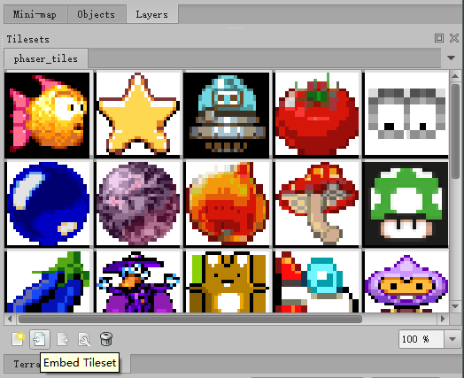

# test-Tiledmapeditor-export-JSON-with-Phaser

##  environment
- Phaser ver :2.6.2
- Tiled map editor:v-0.18.2 and v-1.01

---

##  online link

- [v0.18.2 online demo](https://nimohe.github.io/test-Tiledmapeditor-export-JSON-with-Phaser/v0.18.2/index.html
)
- [v1.0.1 online demo](https://nimohe.github.io/test-Tiledmapeditor-export-JSON-with-Phaser/v1.0.1/index.html)

---

## v0.18.2

code is ok

---

##  v1.0.1
use this Tiled map editor version
show Error log

```
Uncaught TypeError: Cannot read property '2' of undefined
at Object.parseTiledJSON (phaser.min.js:26)
at Object.parse (phaser.min.js:26)
at new c.Tilemap (phaser.min.js:25)
at c.GameObjectFactory.tilemap (phaser.min.js:15)
at Object.create ((index):30)
at c.StateManager.loadComplete (phaser.min.js:10)
at c.Loader.finishedLoading (phaser.min.js:20)
at c.Loader.processLoadQueue (phaser.min.js:20)
at c.Loader.asyncComplete (phaser.min.js:20)
at c.Loader.fileComplete (phaser.min.js:20)
```

###  solved 
- update date(2017-06-22)
- click the `Embed Tileset` button → export JSON file
- then will be ok



---

##  compare two map.json

then I compared two map.json,I found the v1-json `tilesets` less than v0-json.
so maybe this place make bug.

want to know the reason, need to read the Phaser source code.

